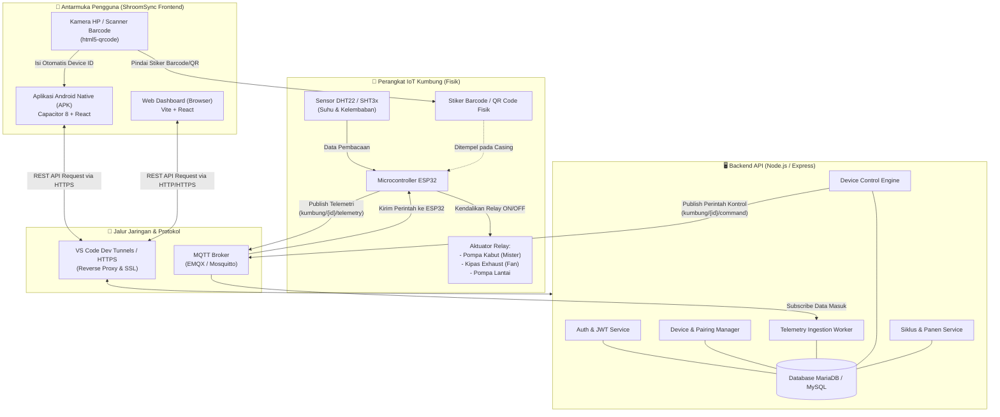
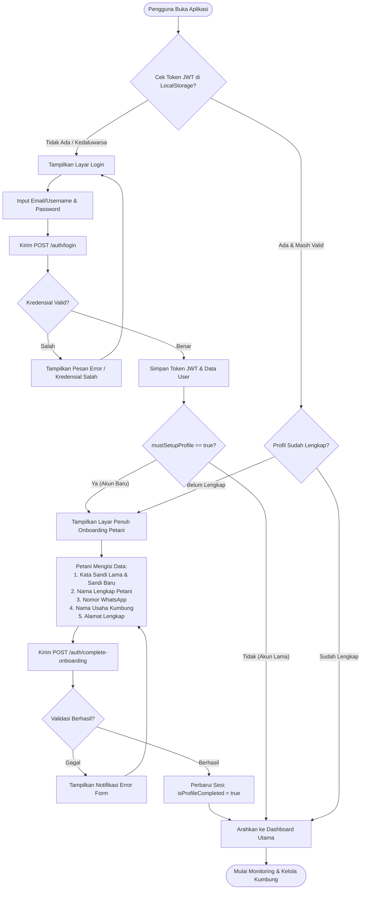
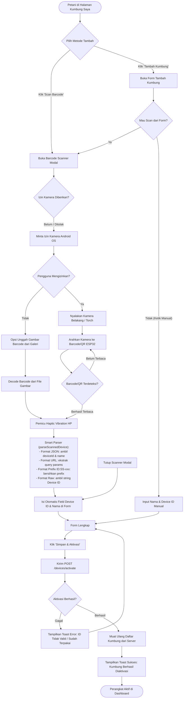
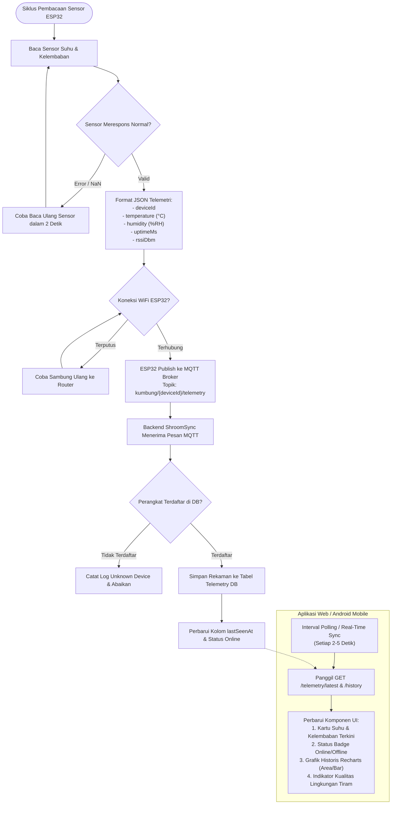
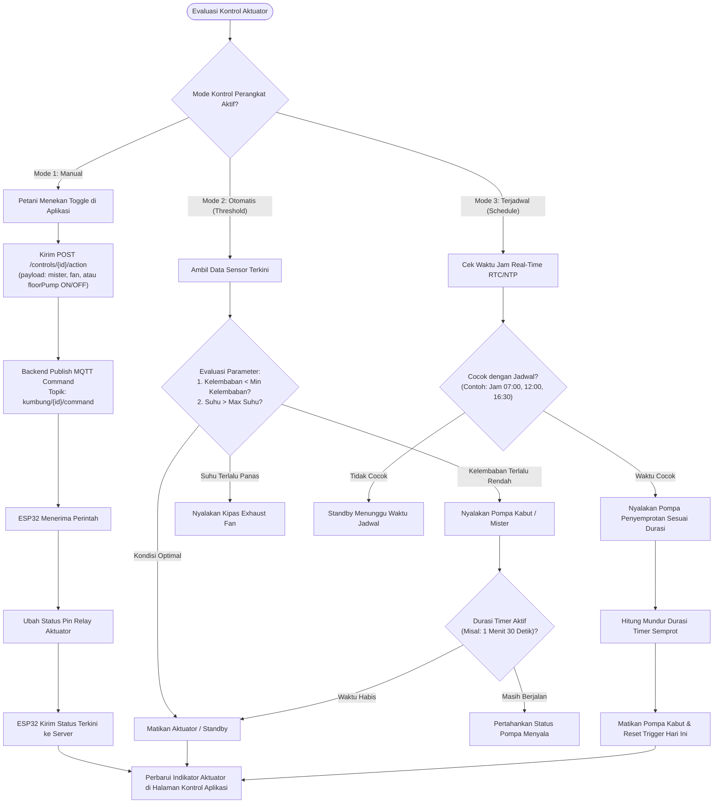
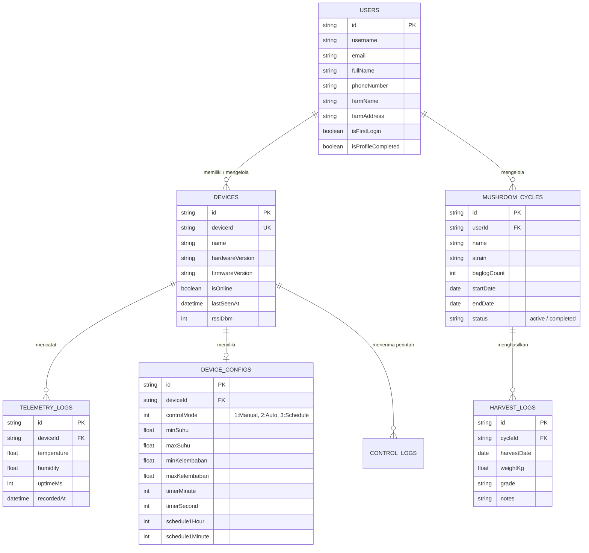

# 📊 Flowchart & Diagram Arsitektur Proyek ShroomSync

Dokumen ini memuat seluruh diagram alur (*flowchart*) sistem **ShroomSync** (Smart Mushroom Cultivation Monitoring & Automation System), mencakup arsitektur end-to-end, alur autentikasi, aktivasi perangkat dengan barcode/QR, telemetri sensor, kontrol aktuator, hingga siklus budidaya & panen.

---

## 1. Flowchart Arsitektur Sistem Keseluruhan (End-to-End)

Diagram ini menggambarkan interaksi antara perangkat keras IoT di kumbung fisik, protokol komunikasi (MQTT & HTTP REST), backend server, hingga antarmuka pengguna (Mobile APK & Web App).



---

## 2. Flowchart Autentikasi & Onboarding Petani Baru

Alur logika saat pengguna masuk ke aplikasi. Jika akun baru pertama kali login (dibuat oleh admin), pengguna diarahkan ke layar penuh **Onboarding** untuk mengganti kata sandi default dan melengkapi data usaha tani.



---

## 3. Flowchart Tambah & Aktivasi Perangkat (Scan Barcode / QR Code)

Alur penambahan kumbung IoT fisik ke akun petani, baik dengan mengetik manual maupun memindai stiker Barcode/QR Code menggunakan kamera HP.



---

## 4. Flowchart Telemetri Sensor & Monitoring Real-Time

Alur pengiriman data pembacaan sensor suhu dan kelembaban dari kumbung jamur hingga dirender menjadi metrik dan grafik interaktif di aplikasi.



---

## 5. Flowchart Kontrol Aktuator (Manual, Otomatis, & Penjadwalan)

Sistem ShroomSync mendukung 3 mode operasional kontrol aktuator untuk menjaga kondisi ideal jamur tiram:
1. **Mode Manual**: Tombol langsung ON/OFF dari aplikasi.
2. **Mode Otomatis**: Menyalakan pompa jika kelembaban di bawah batas minimum (*threshold*).
3. **Mode Terjadwal**: Menyalakan penyemprotan kabut pada jam-jam tertentu.



---

## 6. Flowchart Siklus Budidaya & Pencatatan Panen

Diagram alur pengelolaan siklus tanam jamur tiram, mulai dari penempatan baglog, pemantauan fase pertumbuhan, hingga rekapitulasi hasil panen.

```mermaid
flowchart TD
    StartCycle([Petani Membuka Menu Siklus & Panen]) --> HasActiveCycle{Ada Siklus Aktif?}
    
    HasActiveCycle -- Tidak Ada --> FormNewCycle[Klik 'Mulai Siklus Baru']
    FormNewCycle --> InputCycleData["Isi Informasi Budidaya:<br/>- Nama Siklus (Batch)<br/>- Jenis Jamur (Tiram Putih/Coklat)<br/>- Jumlah Baglog (Misal: 1500 Baglog)<br/>- Tanggal Mulai Tanam<br/>- Target Estimasi Hasil (Kg)"]
    InputCycleData --> SaveNewCycle[Kirim POST /cycles]
    SaveNewCycle --> ActiveCycleCreated[Siklus Aktif Terdaftar]
    
    HasActiveCycle -- Ada Siklus Aktif --> ViewCycleDetails[Tampilkan Progres Hari & Fase Tanam]
    ActiveCycleCreated --> ViewCycleDetails
    
    ViewCycleDetails --> DailyMonitoring[Pemantauan Harian Suhu & Kelembaban Kumbung]
    DailyMonitoring --> PhaseTransition{"Fase Tanam Berjalan:"}
    
    PhaseTransition --> Phase1["Fase 1: Inkubasi Miselium (Hari 1-30)"]
    Phase1 --> Phase2["Fase 2: Pembentukan Pinhead / Primordia (Hari 31-38)"]
    Phase2 --> Phase3["Fase 3: Pertumbuhan Tubuh Buah Siap Petik"]
    
    Phase3 --> HarvestTime{Jamur Sudah Waktunya Panen?}
    HarvestTime -- Belum --> DailyMonitoring
    
    HarvestTime -- Siap Panen --> ClickAddHarvest[Klik 'Catat Hasil Panen']
    ClickAddHarvest --> InputHarvestForm["Input Data Panen:<br/>- Tanggal & Waktu Petik<br/>- Bobot Panen (Kg)<br/>- Kualitas / Grade (A / B / C)<br/>- Catatan Kondisi Tubuh Buah"]
    
    InputHarvestForm --> SaveHarvest[Kirim POST /cycles/{id}/harvests]
    SaveHarvest --> UpdateCycleStats["Sistem Menghitung Otomatis:<br/>1. Total Akumulasi Panen (Kg)<br/>2. Persentase Biological Efficiency Ratio (BER)<br/>3. Estimasi Pendapatan Penjualan"]
    
    UpdateCycleStats --> MoreHarvests{Baglog Masih Produktif (Flushes Berikutnya)?}
    MoreHarvests -- Masih Produktif (Flash 2, 3, 4) --> DailyMonitoring
    MoreHarvests -- Baglog Afkir / Habis Nutrisi --> CloseCycle[Klik 'Selesaikan Siklus Budidaya']
    
    CloseCycle --> GenerateReport[Sistem Menghasilkan Laporan Evaluasi Siklus]
    GenerateReport --> EndCycleArchive([Siklus Diarsipkan & Siap untuk Siklus Baru])
```

---

## 7. Rangkuman Entitas & Relasi Data



